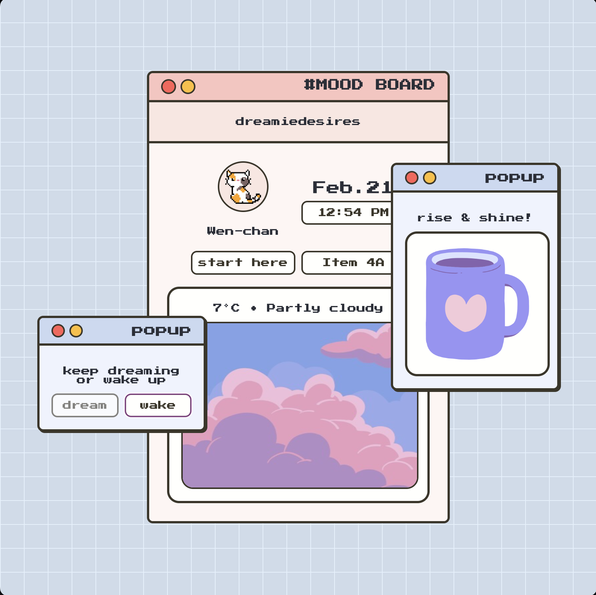

# Weather App

A cozy, everyday mood board.

## Getting Started

To get the project running, follow these steps:

1. Install the dependencies:
    ```bash
    npm install
    ```

2. Start the development server:
    ```bash
    npm run start
    ```

## Screenshot


